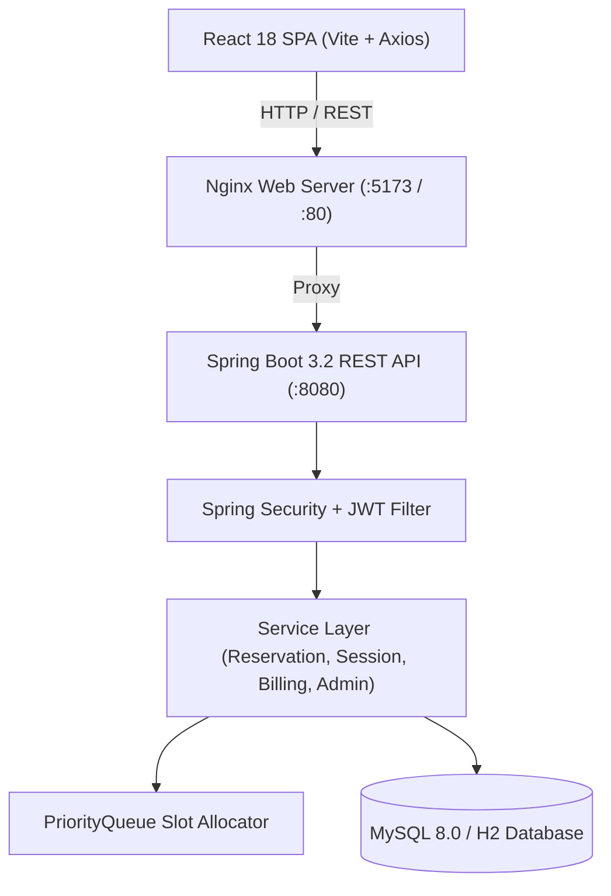
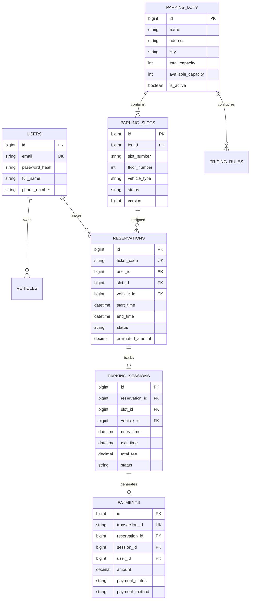

# ParkNow

> **Smart Parking Reservation & Management Platform**

ParkNow is a full-stack, enterprise-grade parking reservation and management platform designed to solve urban parking congestion through intelligent slot allocation, digital ticket generation, automated gate entry/exit session tracking, dynamic fee engine calculations, and real-time administrative analytics.

---

## 📄 Table of Contents
- [1. Project Overview](#1-project-overview)
- [2. Problem Statement](#2-problem-statement)
- [3. Solution](#3-solution)
- [4. Key Features](#4-key-features)
- [5. User Features](#5-user-features)
- [6. Admin Features](#6-admin-features)
- [7. System Architecture](#7-system-architecture)
- [8. Technology Stack](#8-technology-stack)
- [9. Database Design](#9-database-design)
- [10. API Overview](#10-api-overview)
- [11. Authentication & Authorization](#11-authentication--authorization)
- [12. Smart Parking Allocation](#12-smart-parking-allocation)
- [13. Parking Fee Calculation](#13-parking-fee-calculation)
- [14. Screenshots](#14-screenshots)
- [15. Project Structure](#15-project-structure)
- [16. Local Setup](#16-local-setup)
- [17. Environment Variables](#17-environment-variables)
- [18. Docker Setup](#18-docker-setup)
- [19. Testing](#19-testing)
- [20. Future Improvements](#20-future-improvements)
- [21. Learning Outcomes](#21-learning-outcomes)
- [22. Author](#22-author)

---

## 1. Project Overview
ParkNow connects drivers seeking parking with commercial parking facility managers. Drivers can search available parking lots, reserve compatible slots in advance, view digital ticket passes with unique QR identifiers, check into parking facilities, track active parking sessions, and automatically settle billing fees upon exit check-out.

---

## 2. Problem Statement
Urban drivers waste significant time and fuel hunting for vacant parking spaces in congested commercial districts. Existing parking facilities often suffer from manual entry processes, lack of real-time slot visibility, inaccurate overstay penalty calculations, double-booking race conditions during peak hours, and insufficient analytical visibility for facility operators.

---

## 3. Solution
ParkNow provides a centralized, high-concurrency SaaS platform with:
- **Intelligent Slot Allocation Engine**: Min-heap algorithm prioritizing lower floors and lower slot numbers.
- **Concurrency & Race Condition Safety**: Pessimistic database row locks combined with JPA `@Version` optimistic locking to prevent simultaneous double-bookings.
- **Automated Billing Engine**: Time-accurate billing calculating base duration fees, vehicle-type multipliers (`CAR`, `SUV`, `TWO_WHEELER`, `ELECTRIC_VEHICLE`), and late overstay penalty rates.
- **Role-Based Access Control**: Secure RBAC separating driver user portals from facility administrator control centers.

---

## 4. Key Features
- **Stateless JWT Authentication**: Secure password hashing with BCrypt and role-encoded tokens.
- **Digital Reservation Tickets**: Unique ticket codes (`PN-XXXXXXXX`) generated upon reservation confirmation.
- **Automated Gate Entry/Exit Sessions**: State transitions managing slot status updates (`RESERVED` $\rightarrow$ `OCCUPIED` $\rightarrow$ `AVAILABLE`).
- **Real-Time Admin Analytics**: Database-level aggregate queries computing revenue breakdowns, facility occupancy rates, and active sessions.

---

## 5. User Features
- **Authentication**: Driver registration and secure JWT login.
- **Search & Discovery**: Browse active parking lots filtered by location, capacity, and vehicle compatibility.
- **Slot Reservation**: Select vehicle, timeframe, and request optimal slot allocation.
- **Digital Pass**: View reservation ticket with scannable badge and booking details.
- **Active Session Tracking**: Monitor real-time parking entry time, duration, and estimated costs.
- **Gate Check-out & Payments**: Settle billing fees upon exit and review transaction history.
- **Vehicle & Profile Management**: Register multiple personal vehicles (`CAR`, `SUV`, `TWO_WHEELER`, `EV`).

---

## 6. Admin Features
- **Facility Control Center**: Real-time KPI dashboard displaying Total Lots, Total Slots, Revenue, and Occupancy Rate.
- **Parking Lot Management**: CRUD operations to create, edit, activate, or deactivate parking lots.
- **Parking Slot Management**: Configure slot floor numbers, vehicle compatibility, and toggle states (`AVAILABLE`, `MAINTENANCE`, `DISABLED`).
- **Session & Reservation Monitoring**: System-wide view of all active parking sessions and confirmed reservations.
- **Pricing & Fee Rules**: Configure custom hourly rates, peak multipliers, and overstay penalty rates per vehicle type.
- **Financial Reports**: Grouped revenue reports by vehicle type and facility occupancy analytics.

---

## 7. System Architecture



---

## 8. Technology Stack

### Backend
- **Language**: Java 17 (OpenJDK)
- **Framework**: Spring Boot 3.2.4 (Spring Web, Spring Security, Spring Data JPA)
- **Security**: Stateless JWT (`io.jsonwebtoken:jjwt`), BCrypt Password Encoder
- **Database**: MySQL 8.0 (Production), H2 In-Memory DB (Testing/Dev)
- **Data Structures**: Java `PriorityQueue` (Min-Heap), Java Streams API
- **Build & Test**: Apache Maven, JUnit 5, Mockito, Spring Boot Test

### Frontend
- **Framework**: React 18
- **Build Tool**: Vite 5
- **HTTP Client**: Axios with Request/Response Interceptors
- **Routing**: React Router v6 (Protected & Admin Route Guards)
- **UI & Styling**: Vanilla CSS with Dark Glassmorphism Design System, Lucide React Icons

### Infrastructure & DevOps
- **Containerization**: Docker, Docker Compose
- **Web Server**: Nginx Alpine

---

## 9. Database Design



---

## 10. API Overview

### Public Endpoints
- `POST /api/auth/register` - Driver account registration
- `POST /api/auth/login` - User authentication and JWT token issuance
- `GET /api/health` - System status health check

### User Endpoints (`ROLE_USER` / `ROLE_ADMIN`)
- `GET /api/parking-lots` - Search active parking lots
- `GET /api/parking-lots/{id}` - View lot details and slot availability
- `POST /api/reservations` - Create parking reservation
- `GET /api/reservations/my` - List user reservations
- `DELETE /api/reservations/{id}` - Cancel reservation
- `POST /api/sessions/entry` - Gate entry check-in with ticket code
- `POST /api/sessions/{id}/exit` - Gate exit checkout and fee payment

### Admin Endpoints (`ROLE_ADMIN`)
- `GET /api/admin/dashboard` - Facility aggregate statistics
- `POST /api/admin/parking-lots` - Create parking lot
- `PATCH /api/admin/slots/{id}/status` - Update slot operational state
- `GET /api/admin/users` - Paginated user management list
- `GET /api/admin/revenue` - Revenue reports by vehicle type

### Sample API Request & Response

#### Request: Create Reservation (`POST /api/reservations`)
```json
{
  "lotId": 1,
  "vehicleId": 2,
  "vehicleType": "CAR",
  "startTime": "2026-09-13T10:00:00",
  "endTime": "2026-09-13T12:00:00"
}
```

#### Response: Confirmed Reservation Ticket (`201 Created`)
```json
{
  "success": true,
  "message": "Reservation created successfully",
  "data": {
    "id": 14,
    "ticketCode": "PN-A8B9C2D1",
    "lotId": 1,
    "lotName": "Downtown Central Garage",
    "lotAddress": "100 Main Street",
    "slotId": 5,
    "slotNumber": "A-102",
    "floorNumber": 1,
    "licensePlate": "KA-01-AB-1234",
    "vehicleType": "CAR",
    "startTime": "2026-09-13T10:00:00",
    "endTime": "2026-09-13T12:00:00",
    "status": "CONFIRMED",
    "estimatedAmount": 100.00,
    "createdAt": "2026-09-13T01:15:00"
  }
}
```

---

## 11. Authentication & Authorization
- **Authentication**: Custom `JwtAuthenticationFilter` intercepts requests, extracts Bearer tokens, and populates Spring `SecurityContextHolder`.
- **Authorization**: Endpoint authorization is enforced at HTTP security filter chain level and method level via `@PreAuthorize("hasRole('ADMIN')")`.
- **Pre-Seeded Demo Accounts**:
  - Administrator: `admin@parknow.com` / `admin123`
  - Standard Driver: `alex@example.com` / `user123`

---

## 12. Smart Parking Allocation

ParkNow uses a custom Min-Heap priority allocation algorithm implemented in [`SlotPriorityAllocator.java`](file:///c:/Project/SmartParkingSystem/parknow-backend/src/main/java/com/parknow/util/SlotPriorityAllocator.java).

### Allocation Priority Strategy:
1. **Vehicle Type Match**: Filters slots matching requested vehicle type (`CAR`, `SUV`, `TWO_WHEELER`, `EV`).
2. **Lowest Floor First**: Prioritizes `floorNumber ASC` (e.g., Floor 1 over Floor 2 for driver convenience).
3. **Lowest Slot Number**: Prioritizes `slotNumber ASC` on equal floors.

```java
// Priority Queue comparator heapifying candidate parking slots
PriorityQueue<ParkingSlot> pq = new PriorityQueue<>(
    Comparator.comparingInt(ParkingSlot::getFloorNumber)
              .thenComparing(ParkingSlot::getSlotNumber)
);
```

### Concurrency Lock Strategy:
To guarantee race-condition safety under simultaneous user requests:
1. Candidate slot is retrieved using `findByIdWithLock` (Pessimistic Write Lock: `SELECT ... FOR UPDATE`).
2. Database checks for overlapping reservations using timeframe comparison query.
3. JPA Optimistic Locking (`@Version` attribute) prevents stale slot state overrides.

---

## 13. Parking Fee Calculation

Parking fees are computed dynamically by [`BillingServiceImpl.java`](file:///c:/Project/SmartParkingSystem/parknow-backend/src/main/java/com/parknow/service/impl/BillingServiceImpl.java) upon gate exit check-out.

$$\text{Total Fee} = \text{Base Fee} + \text{Overstay Fee}$$

### Fee Breakdown Formula:
1. **Duration Hours**: $H_{\text{duration}} = \max\left(1, \lceil \frac{\text{Actual Exit} - \text{Entry Time (Minutes)}}{60} \rceil\right)$
2. **Base Fee**: $\text{Base Fee} = H_{\text{duration}} \times \text{Base Hourly Rate} \times \text{Peak Multiplier}$
3. **Overstay Penalty Fee**: If $\text{Actual Exit} > \text{Reserved End Time}$:
   $$H_{\text{overstay}} = \lceil \frac{\text{Actual Exit} - \text{Reserved End Time (Minutes)}}{60} \rceil$$
   $$\text{Overstay Fee} = H_{\text{overstay}} \times \text{Overstay Penalty Rate}$$

---

## 14. Screenshots

*(Include screenshots of Landing Page, Find Parking, Reserve Slot, Digital Ticket, Active Parking Session, and Admin Dashboard here)*

| User Portal - Slot Reservation | User Portal - Digital Ticket |
| :---: | :---: |
|  |  |

| Admin Dashboard | Active Parking Session |
| :---: | :---: |
|  |  |

---

## 15. Project Structure

```
ParkNow/
├── parknow-backend/
│   ├── src/main/java/com/parknow/
│   │   ├── config/             # Security, OpenAPI, Cors, DataSeeder
│   │   ├── controller/         # REST API Controllers
│   │   ├── dto/                # Request & Response Contracts
│   │   ├── entity/             # JPA Entities & Enums
│   │   ├── exception/          # GlobalExceptionHandler & Domain Exceptions
│   │   ├── repository/         # Spring Data JPA Repositories
│   │   ├── security/           # JWT Provider, Auth Filters, UserPrincipal
│   │   ├── service/            # Core Business Logic & Billing Engine
│   │   └── util/               # PriorityQueue DSA Allocator & Ticket Generator
│   ├── src/test/java/com/parknow/ # JUnit 5 & Mockito Test Suite
│   └── Dockerfile
├── parknow-frontend/
│   ├── src/
│   │   ├── components/         # Navbar, SlotGrid, TicketCard, Modals
│   │   ├── context/            # AuthContext
│   │   ├── pages/              # User & Admin Portal Pages
│   │   ├── routes/             # AppRoutes & Route Guards
│   │   └── services/           # Axios API Client & Interceptors
│   ├── nginx.conf
│   └── Dockerfile
├── docker-compose.yml
├── .env.example
├── DEPLOYMENT.md
└── README.md
```

---

## 16. Local Setup

### Prerequisites
- JDK 17+
- Node.js 18+
- Maven 3.8+

### 1. Run Backend
```bash
cd parknow-backend
mvn spring-boot:run
```
- API Base URL: `http://localhost:8080`
- Swagger UI Documentation: `http://localhost:8080/swagger-ui.html`
- H2 Console: `http://localhost:8080/h2-console`

### 2. Run Frontend
```bash
cd parknow-frontend
npm install
npm run dev
```
- Web Application: `http://localhost:5173`

---

## 17. Environment Variables

Variables are configured in root `.env`:

```env
DB_NAME=parknow_db
DB_USERNAME=root
DB_PASSWORD=rootpassword
JWT_SECRET=404E635266556A586E3272357538782F413F4428472B4B6250645367566B5970
JWT_EXPIRATION=86400000
VITE_API_BASE_URL=http://localhost:8080/api
```

---

## 18. Docker Setup

Build and run the entire application stack (`MySQL`, `Backend`, `Frontend`):

```bash
docker compose up --build -d
```

Check service status:
```bash
docker compose ps
```

---

## 19. Testing

Execute the backend automated test suite:

```bash
cd parknow-backend
mvn test
```

### Test Coverage Highlights (37 Total Tests Passed):
- `QualityPassEdgeCasesTest`: Defensive null handling, duplicate registration rejection, 404 resource lookups, RBAC HTTP 403 checks, overstay billing calculations.
- `ReservationServiceTest`: `PriorityQueue` min-heap allocation, double booking 409 conflict checks, 2-thread concurrent booking safety.
- `ParkingSessionServiceTest`: Gate entry check-in, exit checkout, automated payment generation.

---

## 20. Future Improvements
- **Third-Party Payment Gateway**: Integration with Stripe / Razorpay webhooks.
- **WebSocket Gateway**: Real-time push notifications for gate barrier events.
- **License Plate Recognition (ANPR)**: Automated camera-based entry verification.

---

## 21. Learning Outcomes
- **Concurrency Management**: Solving high-concurrency race conditions using pessimistic database locks and JPA optimistic locking (`@Version`).
- **Applied DSA**: Implementing Java `PriorityQueue` min-heaps for optimal resource allocation problems.
- **Full-Stack SaaS Architecture**: Building stateless REST APIs connected to a modern React SPA with RBAC route security.

---

## 22. Author
- **Developer**: Ayaansh Raj
- **Project Repository**: [Smart-Parking-System](https://github.com/ayaanshraj2005/Smart-Parking-System-)
